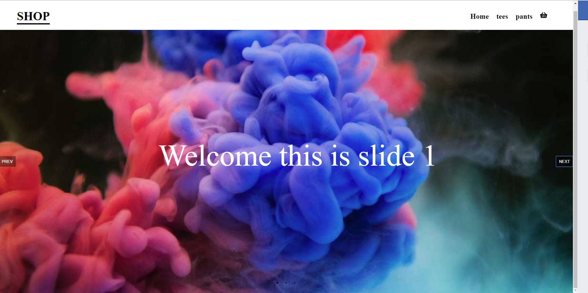

# Gatsby shopify store

# The Project
Building a web store with gatsby and shopify for the backend

# Check it out at
https://socialshop.netlify.com/

# Things to do and improvements
- [X] Basic layout
- [X] Create Collection pages 
- [ ] Create blog pages
- [X] Make a navbar with cart
- [X] Create a Cart
- [X] Slider for homepage
- [X] fix single product page   
- [X] Learn context instead of redux
- [X] Make cart work
- [X] styling 
- [ ] Can't to checkout until i pay for a plan  :(
- [ ] auth 
- [X] Mobile styling

# Screenshots

